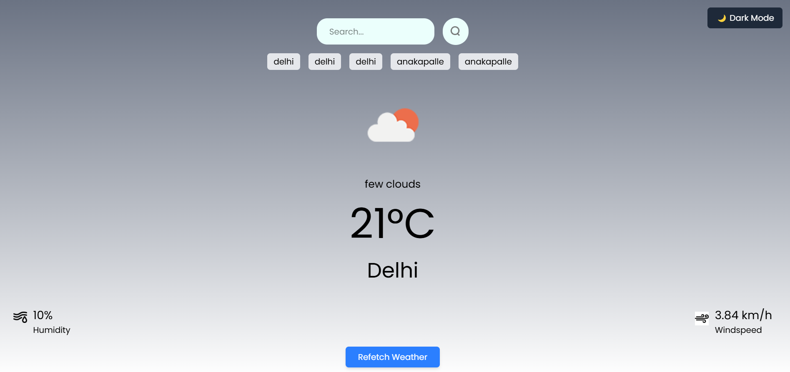
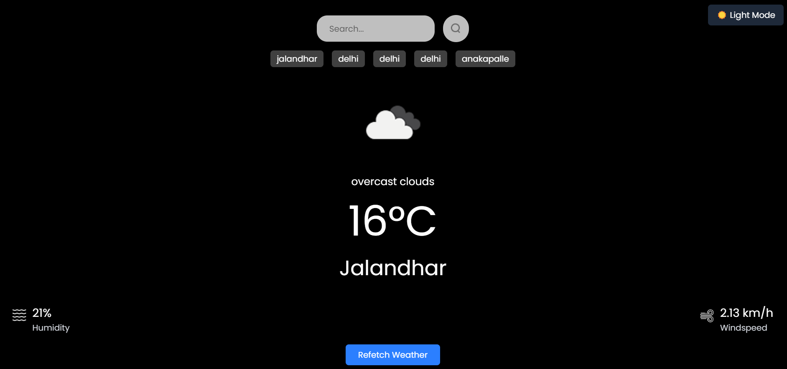

# Weather Dashboard Web App

## 🌦️ Overview
This is a **Weather Dashboard Web App** built with **React.js**. It fetches real-time weather data using the OpenWeatherMap API, displaying temperature, humidity, wind speed, and a weather icon for the searched city.

## 🚀 Features
- 🔍 **Search for a city's weather**
- 🕘 **Search history** (stores last 5 searches in localStorage)
- 🎨 **Light/Dark theme toggle**
- 🔄 **Refetch last searched city's weather**
- 📡 **Live API fetching** from OpenWeatherMap
- 📱 **Fully responsive UI**
- 🌪️ **Loading state handling**
- ❌ **Error handling with toast notifications**

## 🛠️ Tech Stack
- **Frontend:** React.js, Tailwind CSS
- **API:** OpenWeatherMap
- **State Management:** React Hooks (useState, useEffect)
- **Toast Notifications:** react-toastify

## 📂 Project Structure
```
weather-dashboard/
│-- src/
│   │-- assets/               # Images and icons
│   │-- components/
│   │   ├── Weather.js       # Main weather component
│   │-- App.js               # Root component
│   │-- main.jsx             # React entry file
│-- public/
│-- .env                     # API Key Configuration
│-- package.json             # Dependencies and scripts
│-- README.md                # Project documentation
```

## 📦 Installation
### 1️⃣ Clone the repository
```bash
git clone https://github.com/badampudimahesh2005/weather_app.git
cd weather-app
```
### 2️⃣ Install dependencies
```bash
npm install
```
### 3️⃣ Set up OpenWeatherMap API Key
1. Create a `.env` file in the root directory.
2. Add the following line:
```env
VITE_WEATHER_API_KEY=your_api_key_here
```
> 🔑 **Get your API key** from [OpenWeatherMap](https://home.openweathermap.org/api_keys).

### 4️⃣ Start the development server
```bash
npm run dev
```


## 🖼️ Screenshots
![Weather Dashboard Screenshot]



## 🤝 Contributing
1. Fork the project
2. Create your feature branch: `git checkout -b feature-name`
3. Commit your changes: `git commit -m 'Add some feature'`
4. Push to the branch: `git push origin feature-name`
5. Open a pull request


---
Made with ❤️ by [Mahesh](https://github.com/badampudimahesh2005)

